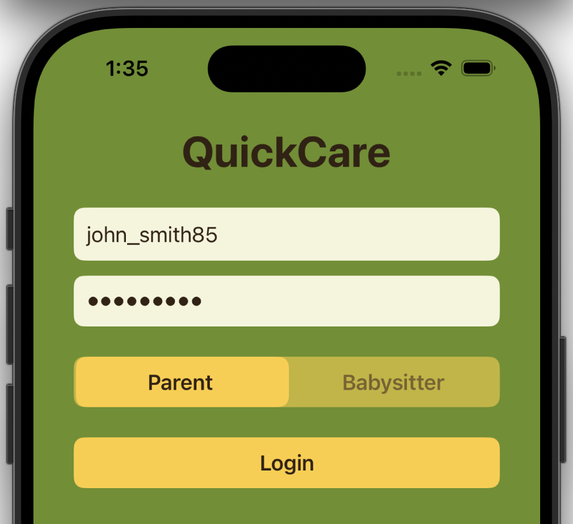

# QuickCare App

**QuickCare** is a SwiftUI demo app for on-demand childcare, designed for a class (Globalization, Innovation, & Entreprenuership) project focusing on extending innovation overseas. The app connects parents with babysitters and vise versa, allowing parents to filter sitters by budget and duration, and sitters to view available families by wage. It also includes ETA/directions features for real-world usability.

---

## Table of Contents

- [About](#About)
- [Features](#Features)
- [Screenshots & Demo](#Screenshots--Demo)
- [Tech Stack](#Tech-Stack)
- [Repository Structure](#Repository-Structure)
- [How to Run](#How-to-Run)
- [Potential Improvements](#Potential-Improvements)

---

## About

This app was developed for a class presentation to demonstrate a real-world on-demand service concept (BabySitting in the UK). It showcases clean code organization, reusable components, and user-friendly design.

---

## Features

- **Role selection:** Choose between *Parent* or *Babysitter* roles.
- **Budget & wage filtering:** Parents filter sitters by total budget and hours; sitters filter families by hourly wage.
- **ETA & directions:** Parents see sitters’ estimated arrival times and current location; sitters can view their estimate ETA and open directions to family addresses.
- **Custom UI & animations:** Includes animated toggle, custom colors, and polished SwiftUI design.

---

## Screenshots & Demo

### Login Screen


### BabySitter Selection & ETA / Directions Screen


---

## Tech Stack

- SwiftUI  
- iOS 16+  
- Xcode 14+  
- Swift 5.9  
- Core features: State management, animations, navigation, dynamic UI  

---

## Repository Structure
```plaintext
QuickCareApp/
├── docs/                # README Images, GIFs
├── README.md
├── QuickCareApp.xcodeproj
└── QuickCareApp/
	├── Assets.xcassets/ # App Embedded Images
	├── Preview Content/
	└── ContentView.Swift
```

---

## How to Run

1. Clone the repository:  
```bash
git clone https://github.com/your-username/QuickCareApp.git
```
2. Open QuickCareApp.xcodeproj in Xcode.
3. Build and run on a simulator or device running iOS 16+.

---

## Potential Improvements

- Integrate with a backend API to fetch real users.
- Add authentication with Firebase or custom backend.
- Persist user preferences and previous matches.
- Push notifications for ETA updates.
- Improved UI/UX animations and accessibility enhancements.
- Embed directions.
